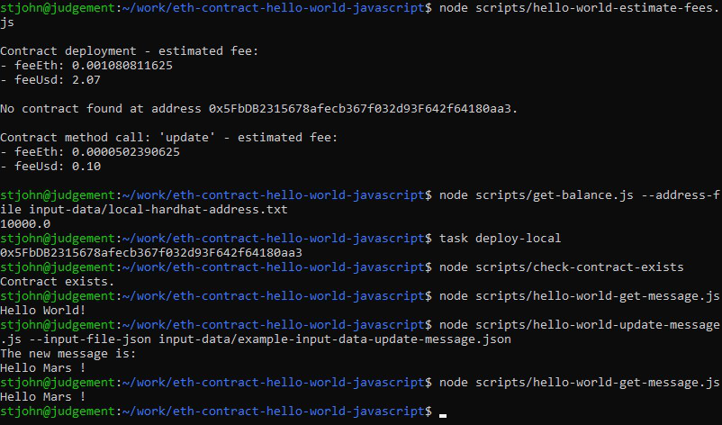
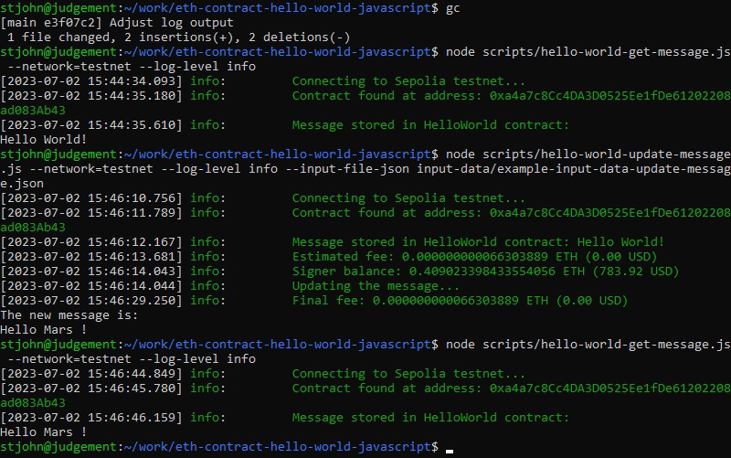

<a name="readme-top"></a>


<!-- PROJECT SHIELDS -->
<!--
*** We use markdown "reference style" links for readability.
*** Reference links are enclosed in brackets [ ] instead of parentheses ( ).
*** See the bottom of this document for the declaration of the reference variables
*** for contributors-url, forks-url, etc. This is an optional, concise syntax you may use.
*** https://www.markdownguide.org/basic-syntax/#reference-style-links
-->
[![Tela][tela-shield]][tela-url]
[![LinkedIn][linkedin-shield]][linkedin-url]
[![AGPL V3 License][license-shield]][license-url]


<!-- PROJECT LOGO -->
<br />
<div align="center">
  <a href="https://github.com/sj-piano/eth-contract-hello-world-javascript">
    
  </a>
  <h3 align="center">Ethereum (ETH) smart contract "Hello World"</h3>
</div>


<!-- TABLE OF CONTENTS -->
<details>
  <summary>Table of Contents</summary>
  <ol>
    <li>
      <a href="#about-the-project">About The Project</a>
      <ul>
        <li><a href="#built-with">Built With</a></li>
      </ul>
    </li>
    <li>
      <a href="#getting-started">Getting Started</a>
      <ul>
        <li><a href="#prerequisites">Prerequisites</a></li>
        <li><a href="#installation">Installation</a></li>
      </ul>
    </li>
    <li>
      <a href="#usage">Usage</a>
      <ul>
        <li><a href="#initial-tests">Initial tests</a></li>
        <li><a href="#walkthrough-local">Walkthrough - Local network</a></li>
        <li><a href="#walkthrough-testnet">Walkthrough - Sepolia Testnet</a></li>
        <li><a href="#walkthrough-mainnet">Walkthrough - Ethereum Mainnet</a></li>
      </ul>
    </li>
    <li><a href="#roadmap">Roadmap</a></li>
    <li><a href="#contributing">Contributing</a></li>
    <li><a href="#license">License</a></li>
    <li><a href="#contact">Contact</a></li>
    <li><a href="#acknowledgments">Acknowledgments</a></li>
  </ol>
</details>


<!-- ABOUT THE PROJECT -->
## About The Project

**Description:**

A complete "Hello World" Ethereum smart contract package, written in Solidity and Javascript. It is a ready-to-use template for an Ethereum smart contract development project.

**Features:**
* Handles post-merge fees correctly
* Can estimate fees before any actual transactions are sent
* Includes a test suite that runs on local Hardhat blockchain instance
* Can deploy to local blockchain instance, Sepolia testnet, and Ethereum mainnet

**Licensing:**
* AGPL v3 software license
* Licensed for personal use
* Licensed for commercial use, if and only if all derivative source code is made public
* A private commercial software license is available for purchase - this removes the obligation for your company to publish any derived source code

**If you would like to:**
* ask a question
* report a bug
* ask for an addition to the README
* request a feature
* get a private commercial software license
* make a complaint
* hire me

Then [please contact me on Tela](https://www.tela.app/magic/stjohn_piano/a852c8). Thank you.

[![Tela][tela-shield]][tela-url]

If you would like to add me as a professional contact, you can [send me a connection request on LinkedIn](https://www.linkedin.com/in/stjohnpiano):

[![LinkedIn][linkedin-shield]][linkedin-url]


<p align="right">(<a href="#readme-top">back to top</a>)</p>


### Built With


**Platforms & languages:**
- [Ethereum](https://ethereum.org/en) & [Solidity](https://soliditylang.org)
- [NodeJS](https://nodejs.org/en) & [Javascript](https://developer.mozilla.org/en-US/docs/Web/JavaScript)

**Technologies & libraries:**
- Task management: [`task`](https://taskfile.dev/)
- NodeJS manager: [`nvm`](https://github.com/nvm-sh/nvm)
- Ethereum library: [`ethers`](https://docs.ethers.org/v6)
- Ethereum development environment: [`hardhat`](https://hardhat.org)
- Decimal arithmetic: [`big.js`](https://mikemcl.github.io/big.js)
- Test assertion: [`chai`](https://www.chaijs.com)
- Javascript formatter: [`prettier-standard`](https://github.com/sheerun/prettier-standard)
- CLI interface: [`commander`](https://github.com/tj/commander.js)
- Logging: [`winston`](https://github.com/winstonjs/winston)
- Data validation: [`joi`](https://github.com/hapijs/joi)
- JSON validation: [`ajv`](https://ajv.js.org)

Private keys are managed in a `.env` file.

<p align="right">(<a href="#readme-top">back to top</a>)</p>


<!-- GETTING STARTED -->
## Getting Started

Follow these steps to get a local development instance up and running.


### Prerequisites

Please create accounts and API keys at:
* [Etherscan](https://etherscan.io)
* [Infura](https://www.infura.io)

Please install:

* task: [guide](https://taskfile.dev/installation)
* nvm (Node Version Manager): [guide](https://github.com/nvm-sh/nvm#install--update-script)
* npm & NodeJS: [nvm-based guide](https://github.com/nvm-sh/nvm#usage)
* Metamask wallet (browser extension): [metamask.io](https://metamask.io)

Tested under these operating systems:
* Ubuntu 20.04.6 LTS (Focal Fossa) (Running on WSL 2 on Windows 10)

Tested with these versions:
* task: 3.27.0
* nvm: 0.35.3
* npm: 9.5.1
* NodeJS: 18.16.0

Notes:
* Use `nvm` to install `npm` and NodeJS.
* The Etherscan API key is used if you want to upload your contract to Etherscan when using [Hardhat verify](https://hardhat.org/hardhat-runner/plugins/nomicfoundation-hardhat-verify).


### Installation

Clone the repo:

```sh
git clone https://github.com/sj-piano/eth-contract-hello-world-javascript
```

Install NPM packages:

```sh
cd eth-contract-hello-world-javascript && npm install
```

Copy the file `.env.example` to `.env` and fill it in with the relevant values.

**IMPORTANT: Pay particular attention to the settings in the top section: `FINANCIAL CONTROLS`**

- Make sure that you are happy with these settings. If nothing else, be careful to at least double-check the `MAX_FEE_PER_TRANSACTION_USD` setting. This will govern how much you could potentially spend when connecting to the Ethereum mainnet.

Notes:

* When you run a local hardhat node, it will have some built-in private keys and addresses that hold some test Ethereum. In `.env.example`, the `LOCAL_HARDHAT_PRIVATE_KEY` and `LOCAL_HARDHAT_ADDRESS` values hold the first of these keypairs.


<p align="right">(<a href="#readme-top">back to top</a>)</p>


## Usage


### Notes

`config.js` stores the configuration used within the entire package. You probably won't need to look at it. Settings in the `.env` file override it.

Most scripts accept a `network` argument, which specifies whether the script should connect to the local development blockchain (`local`), the Sepolia testnet (`testnet`), or the Ethereum mainnet (`mainnet`).

Most scripts have `--help` functionality. E.g. you can run `node scripts/hello-world-update-message.js --help`

Most scripts can log at different levels of output. You can use `--log-level info` or `--debug` arguments.

Run `task show-example-script-commands` to see a list of examples that demonstrate how to use the various scripts.


### Initial tests

Run `task --list` (or `task -l`) to see available commands.

Run some initial tasks to check that everything is set up correctly.

```sh
task hello

task check-network-connections
```

Compile the contract and run the tests.

```sh
task compile-contracts

task test
```

Check the fees on the various networks.

```sh
node scripts/get-network-fees.js

node scripts/get-network-fees.js --network=testnet

node scripts/get-network-fees.js --network=mainnet
```


### Walkthrough - Local network


Hardhat runs the tests on a temporary local blockchain.

We set up a more persistent local blockchain, and deploy the HelloWorld contract to it.

Open another terminal and run: `task start-local-node`

Leave the node running in this additional terminal. Log output will be displayed (the initial set of pre-loaded keypairs will be shown). Press Ctrl-C to stop the local node. Switch back to the original terminal and continue.

Run `node scripts/hello-world-estimate-fees.js` to see fee estimations for the different contract operations.

Run `node scripts/get-balance.js --address-file input-data/local-hardhat-address.txt` to find the current balance of the address that will deploy the contract.

Deploy the HelloWorld contract: `task deploy-local`

Note: If you would like to see log output during deployment, use the underlying script command: `node scripts/hello-world-deploy.js --log-level info`

This will output an address. Copy this address into the `.env` file as `LOCAL_HARDHAT_DEPLOYED_CONTRACT_ADDRESS`.

Run `node scripts/check-contract-exists` to confirm deployment.

Run `node scripts/hello-world-get-message.js` to print the message stored in the contract.

Copy the example input file:
`cp input-data/example-update-message.json input-data/update-message-local-network.json`

Open it and specify a new message e.g. `Hello Mars !`.

Run `node scripts/hello-world-update-message.js --input-file-json input-data/update-message-local-network.json` to update the message stored in the contract.

Run `node scripts/hello-world-get-message.js` again to print the new message stored in the contract.

Example output:




### Walkthrough - Sepolia testnet


You'll need some SepoliaETH for using the Sepolia Testnet. In your Metamask wallet, create a dedicated "Test" account. Switch to "Sepolia test network". Copy the address. Go to a Sepolia testnet faucet (e.g. this [PoW faucet](https://sepolia-faucet.pk910.de)) and get some SepoliaETH. Set the destination address to be your Metamask test address.

We will use the `info` logging level throughout this walkthrough.

Run `node scripts/create-private-key.js > input-data/testnet-sepolia-private-key.txt` to create a new private key and store it in the `input-data` directory.

Run `cat input-data/testnet-sepolia-private-key.txt` to display the private key. Store it in the `.env` file as `TESTNET_SEPOLIA_PRIVATE_KEY`.

Run `cat input-data/testnet-sepolia-private-key.txt | node scripts/derive-address.js > input-data/testnet-sepolia-address.txt` to derive an Ethereum address from the private key and store it in the `input-data` directory.

Run `cat input-data/testnet-sepolia-address.txt` to display the address. Store it in the `.env` file as `TESTNET_SEPOLIA_ADDRESS`.

Run `node scripts/get-balance.js --network=testnet --log-level info --address-file input-data/testnet-sepolia-address.txt` to see the balance of the address. Currently it should be `0`.

In Metamask, transfer a reasonable amount of SepoliaETH to your new address that is stored in `testnet-sepolia-address.txt`.

Run `node scripts/hello-world-deploy.js --network=testnet --log-level info` to deploy the contract to the Sepolia testnet.

This will output an address. Copy this address into the `.env` file as `TESTNET_SEPOLIA_DEPLOYED_CONTRACT_ADDRESS`.

Run `node scripts/check-contract-exists --network=testnet --log-level info` to confirm deployment.

Run `node scripts/hello-world-get-message.js --network=testnet --log-level info` to print the message stored in the contract.

Copy the example input file:
`cp input-data/example-update-message.json input-data/update-message-sepolia-testnet.json`

Open it and specify a new message e.g. `Hello Mars !`.

Run `node scripts/hello-world-update-message.js --network=testnet --log-level info --input-file-json input-data/update-message-sepolia-testnet.json` to update the message stored in the contract.

Run `node scripts/hello-world-get-message.js --network=testnet --log-level info` again to print the new message stored in the contract.

Example output:




### Walkthrough - Ethereum mainnet


If you wish to retrieve your SepoliaETH from the address created in the Sepolia testnet walkthrough (e.g. you want to transfer it back to your Metamask test account), you'll need to use a tool that can make the transfer (create, sign, broadcast, and track the transaction). Such a tool is not provided in this project.

Note that SepoliaETH is not worth anything, and it is reasonably straightforward to obtain more from a faucet.

However, actual Ethereum (ETH), used on the Ethereum mainnet, does have monetary value. Therefore, in this section, we recommend creating a new Metamask account (explicitly for test operations) and exporting its private key for use in this walkthrough. This means that afterwards there will be no need to make a retrieval transaction.

Note: If you know what you're doing, and you already have a capable transaction tool, you can create a new keypair, transfer some ETH to it, perform this walkthrough on the mainnet, and transfer any remaining ETH back to your original address.

So, let's begin.

We will use the `debug` logging level throughout this walkthrough.

In your Metamask wallet, create a dedicated "Test" account. Switch to "Ethereum Mainnet". We assume that you already have some Ethereum in Metamask or in another wallet tool. Transfer some ETH to this address. Copy the address.

Store it in the `.env` file as `ETHEREUM_MAINNET_ADDRESS`.

Store it in the `input-data` directory in a new file called `ethereum-mainnet-address.txt`.

Now, export the corresponding private key from Metamask, using the following guide:

Metamask: [How to export an account's private key](https://support.metamask.io/hc/en-us/articles/360015289632-How-to-export-an-account-s-private-key)

Store it in the `.env` file as `ETHEREUM_MAINNET_PRIVATE_KEY`.

Store it in the `input-data` directory in a new file called `ethereum-mainnet-private-key.txt`.

Run `node scripts/get-balance.js --network=mainnet --log-level debug --address-file input-data/ethereum-mainnet-address.txt` to see the balance of the address. It should be a non-zero value.

Run `node scripts/hello-world-deploy.js --network=mainnet --log-level debug` to deploy the contract to the Sepolia testnet.

This will output an address. Copy this address into the `.env` file as `ETHEREUM_MAINNET_DEPLOYED_CONTRACT_ADDRESS`.

Run `node scripts/check-contract-exists --network=mainnet --log-level debug` to confirm deployment.

Run `node scripts/hello-world-get-message.js --network=mainnet --log-level debug` to print the message stored in the contract.

Copy the example input file:
`cp input-data/example-update-message.json input-data/ethereum-mainnet-update-message.json`

Open it and specify a new message e.g. `Hello Mars !`.

Run `node scripts/hello-world-update-message.js --network=mainnet --log-level debug --input-file-json input-data/ethereum-mainnet-update-message.json` to update the message stored in the contract.

Run `node scripts/hello-world-get-message.js --network=mainnet --log-level debug` again to print the new message stored in the contract.

Example output:


<p align="right">(<a href="#readme-top">back to top</a>)</p>


## Roadmap

This project is complete. No future features or fixes are planned.


<p align="right">(<a href="#readme-top">back to top</a>)</p>


<!-- CONTRIBUTING -->
## Contributing


If you have enjoyed this project or found it helpful, please give it a star!


Feel free to fork the project and use it for development. Please add an acknowledgement to this project in your README file.


Please note: Github issues & pull requests will not be read unless you contact me about them in Tela.

[![Tela][tela-shield]][tela-url]


<!-- LICENSE -->
## License

Distributed under the GNU Affero General Public License (AGPL). See `LICENSE.txt` for more information.


<p align="right">(<a href="#readme-top">back to top</a>)</p>


## Contact


Project Link:
[https://github.com/sj-piano/eth-contract-hello-world-javascript](https://github.com/sj-piano/eth-contract-hello-world-javascript)


**If you would like to:**
* ask a question
* report a bug
* ask for an addition to the README
* request a feature
* get a private commercial software license
* make a complaint
* hire me

Then [please contact me on Tela](https://www.tela.app/magic/stjohn_piano/a852c8). Thank you.

[![Tela][tela-shield]][tela-url]

If you would like to add me as a professional contact, you can [send me a connection request on LinkedIn](https://www.linkedin.com/in/stjohnpiano):

[![LinkedIn][linkedin-shield]][linkedin-url]


## Acknowledgments


* Choose an Open Source License: [choosealicense.com](https://choosealicense.com)

* Badges: [shields.io](https://shields.io)

* How Hardhat runs a local Ethereum blockchain for testing and development: [Hardhat Network](https://hardhat.org/hardhat-network/docs/overview)

* README template by Othneil Drew: [Best-README-Template](https://github.com/othneildrew/Best-README-Template)

* Sepolia testnet PoW faucet: https://sepolia-faucet.pk910.de

* Metamask: [How to export an account's private key](https://support.metamask.io/hc/en-us/articles/360015289632-How-to-export-an-account-s-private-key)


<p align="right">(<a href="#readme-top">back to top</a>)</p>


<!-- MARKDOWN LINKS & IMAGES -->
<!-- https://www.markdownguide.org/basic-syntax/#reference-style-links -->
[license-shield]: https://img.shields.io/github/license/sj-piano/eth-contract-hello-world-javascript.svg?style=for-the-badge
[license-url]: https://github.com/sj-piano/eth-contract-hello-world-javascript/blob/main/LICENSE.txt
[linkedin-shield]: https://img.shields.io/badge/LinkedIn-StJohn_Piano-blue.svg?style=for-the-badge&logo=linkedin
[linkedin-url]: https://linkedin.com/in/stjohnpiano
[tela-shield]: https://img.shields.io/badge/Tela-StJohn_Piano-blue?style=for-the-badge
[tela-url]: https://www.tela.app/magic/stjohn_piano/a852c8
